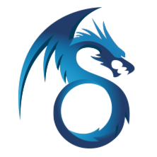

# SyZero

<p align="center">
  
</p>

<p align="center">
  <strong>A lightweight, modular .NET microservice framework</strong>
</p>

<p align="center">
  <a href="https://github.com/HaitaoJin/SyZero"></a>
  <a href="https://github.com/HaitaoJin/SyZero/blob/main/LICENSE"></a>
  <a href="https://www.nuget.org/packages/SyZero"></a>
  <a href="https://docs.syzero.com/"></a>
</p>

<p align="center">
  <a href="README.md">简体中文</a> | English
</p>

---

## Overview

SyZero is a modular microservice framework for .NET. It provides rich components and tooling to help you build high-performance and scalable distributed applications faster.

## Key Features

- Modular architecture: reference only what you need.
- Service governance: Consul and Nacos integration for registration, discovery, and health checks.
- Data access: built-in support for EF Core, SqlSugar, and MongoDB with repository abstractions.
- High performance: Redis cache, RabbitMQ messaging, and OpenTelemetry tracing.
- Dynamic APIs: auto-generate RESTful APIs and gRPC services with Swagger docs.
- DDD-friendly: domain-driven design patterns and dependency injection support.

## Core Modules

| Module | NuGet | Description |
|------|------|------|
| **SyZero** | [](https://www.nuget.org/packages/SyZero) | Core module for base infrastructure and DI |
| **SyZero.AspNetCore** | [](https://www.nuget.org/packages/SyZero.AspNetCore) | ASP.NET Core integration |
| **SyZero.AspNetCore.SpaProxy** | [](https://www.nuget.org/packages/SyZero.AspNetCore.SpaProxy) | SPA proxy support for local frontend-backend integration |
| **SyZero.DynamicWebApi** | [](https://www.nuget.org/packages/SyZero.DynamicWebApi) | Dynamic Web API generation |
| **SyZero.DynamicGrpc** | [](https://www.nuget.org/packages/SyZero.DynamicGrpc) | Dynamic gRPC service generation |
| **SyZero.Swagger** | [](https://www.nuget.org/packages/SyZero.Swagger) | Swagger API documentation |

### Data Access

| Module | NuGet | Description |
|------|------|------|
| **SyZero.EntityFrameworkCore** | [](https://www.nuget.org/packages/SyZero.EntityFrameworkCore) | EF Core integration (SQL Server/MySQL) |
| **SyZero.SqlSugar** | [](https://www.nuget.org/packages/SyZero.SqlSugar) | SqlSugar ORM integration |
| **SyZero.MongoDB** | [](https://www.nuget.org/packages/SyZero.MongoDB) | MongoDB support |

### Cache and Messaging

| Module | NuGet | Description |
|------|------|------|
| **SyZero.Redis** | [](https://www.nuget.org/packages/SyZero.Redis) | Redis cache, service management, and Redis event bus |
| **SyZero.RabbitMQ** | [](https://www.nuget.org/packages/SyZero.RabbitMQ) | RabbitMQ messaging and event bus |

> Built-in lightweight event buses are also available in core: `LocalEventBus` (in-memory) and `DBEventBus` (database-backed).

### Service Governance

| Module | NuGet | Description |
|------|------|------|
| **SyZero.Consul** | [](https://www.nuget.org/packages/SyZero.Consul) | Consul registration and discovery |
| **SyZero.Nacos** | [](https://www.nuget.org/packages/SyZero.Nacos) | Nacos registration and configuration |
| **SyZero.ApiGateway** | [](https://www.nuget.org/packages/SyZero.ApiGateway) | API gateway support |
| **SyZero.Feign** | [](https://www.nuget.org/packages/SyZero.Feign) | Declarative HTTP client |

### Utilities and Extensions

| Module | NuGet | Description |
|------|------|------|
| **SyZero.AutoMapper** | [](https://www.nuget.org/packages/SyZero.AutoMapper) | AutoMapper integration |
| **SyZero.Log4Net** | [](https://www.nuget.org/packages/SyZero.Log4Net) | Log4Net support |
| **SyZero.OpenTelemetry** | [](https://www.nuget.org/packages/SyZero.OpenTelemetry) | OpenTelemetry distributed tracing |
| **SyZero.Web.Common** | [](https://www.nuget.org/packages/SyZero.Web.Common) | Common web components and shared capabilities |

## Quick Start

### Install

Install core package:

```bash
dotnet add package SyZero
```

Install extra modules as needed:

```bash
dotnet add package SyZero.AspNetCore
dotnet add package SyZero.DynamicWebApi
dotnet add package SyZero.SqlSugar
dotnet add package SyZero.Swagger
```

### Minimal API setup

```csharp
using SyZero;
using SyZero.DynamicWebApi;
using SyZero.Swagger;

var builder = WebApplication.CreateBuilder(args);

builder.AddSyZero();

builder.Services.AddControllers();
builder.Services.AddDynamicWebApi(new DynamicWebApiOptions()
{
    DefaultApiPrefix = "/api",
    DefaultAreaName = "MyService"
});

builder.Services.AddSwagger();

builder.Services.AddSyZeroSqlSugar();
builder.Services.AddSyZeroAutoMapper();

var app = builder.Build();

app.UseSyZero();
app.UseSwagger();
app.UseSwaggerUI();
app.MapControllers();

app.Run();
```

### Configuration example

```json
{
  "SyZero": {
    "Name": "MyService",
    "Protocol": "http",
    "Port": 5000,
    "Ip": "",
    "WanIp": ""
  },
  "ConnectionString": {
    "DbType": "MySql",
    "ConnectionString": "Server=localhost;Database=mydb;User=root;Password=123456;"
  },
  "Redis": {
    "Configuration": "localhost:6379",
    "InstanceName": "MyService:"
  },
  "RabbitMQ": {
    "HostName": "localhost",
    "Port": 5672,
    "UserName": "guest",
    "Password": "guest"
  },
  "Consul": {
    "Address": "http://localhost:8500"
  },
  "Nacos": {
    "ServerAddresses": ["http://localhost:8848"],
    "Namespace": "public"
  }
}
```

### Dependency injection

SyZero supports automatic registration via marker interfaces:

```csharp
public class UserService : IUserService, IScopedDependency { }
public class ConfigService : IConfigService, ISingletonDependency { }
public class EmailService : IEmailService, ITransientDependency { }
```

Manual registration is also supported:

```csharp
builder.Services.AddScoped<IMyService, MyService>();
builder.Services.AddSingleton<IMySingletonService, MySingletonService>();
builder.Services.AddTransient<IMyTransientService, MyTransientService>();
```

## Service Management

SyZero provides a unified `IServiceManagement` abstraction with multiple backends:

| Implementation | Scenario | Notes |
|------|------|------|
| **LocalServiceManagement** | Local dev/testing | File-based, no external dependency |
| **DBServiceManagement** | Small production setups | Database-backed with multi-instance support |
| **RedisServiceManagement** | Distributed environments | Redis-based with pub/sub notifications |
| **ConsulServiceManagement** | Production | Full-featured Consul integration |
| **NacosServiceManagement** | Production | Nacos integration with config center support |

## Event Bus

SyZero provides a unified `IEventBus` abstraction:

| Implementation | Scenario | Notes |
|------|------|------|
| **LocalEventBus** | Monolith/in-process | In-memory and high-performance |
| **DBEventBus** | Persistence required | Durable storage and retries |
| **RedisEventBus** | Lightweight distributed broadcast | Redis Pub/Sub based |
| **RabbitMQEventBus** | Microservices/distributed systems | Reliable cross-service delivery |

## Project Structure

```text
SyZero/
├── src/
│   ├── SyZero.Core/                    # Core modules
│   │   ├── SyZero/                     # Core library
│   │   ├── SyZero.AspNetCore/          # ASP.NET Core integration
│   │   ├── SyZero.AutoMapper/          # AutoMapper support
│   │   ├── SyZero.Consul/              # Consul discovery
│   │   ├── SyZero.DynamicGrpc/         # Dynamic gRPC
│   │   ├── SyZero.DynamicWebApi/       # Dynamic Web API
│   │   ├── SyZero.EntityFrameworkCore/ # EF Core support
│   │   ├── SyZero.Feign/               # Declarative HTTP client
│   │   ├── SyZero.Log4Net/             # Log4Net logging
│   │   ├── SyZero.MongoDB/             # MongoDB support
│   │   ├── SyZero.Nacos/               # Nacos support
│   │   ├── SyZero.OpenTelemetry/       # Distributed tracing
│   │   ├── SyZero.RabbitMQ/            # RabbitMQ messaging
│   │   ├── SyZero.Redis/               # Redis caching
│   │   ├── SyZero.SqlSugar/            # SqlSugar ORM
│   │   ├── SyZero.Swagger/             # Swagger docs
│   │   └── SyZero.Web.Common/          # Common web components
│   ├── SyZero.Gateway/                 # API gateway sample
│   └── SyZero.Service/                 # Service samples
├── docs/                               # Documentation
├── nuget/                              # NuGet packaging scripts
├── README.md                           # Chinese README
└── README.en.md                        # English README
```

## Tech Stack

- .NET 9.0+ and .NET Standard 2.1+
- Visual Studio 2022, VS Code, Rider
- SQL Server, MySQL, MongoDB, PostgreSQL (optional)
- Redis (optional)
- RabbitMQ (optional)
- Consul, Nacos, Local, DB, Redis service management (optional)
- OpenTelemetry (optional)

## Documentation

- Chinese docs: https://docs.syzero.com/
- English docs: https://docs.syzero.com/en/

## Changelog

See [release notes](docs/en/release-notes.md).

## Contributing

Issues and pull requests are welcome.

1. Fork this repository.
2. Create a feature branch (`git checkout -b feature/AmazingFeature`).
3. Commit your changes (`git commit -m 'Add some AmazingFeature'`).
4. Push to your branch (`git push origin feature/AmazingFeature`).
5. Open a pull request.

## License

This project is licensed under [MIT License](LICENSE).

## Author

**HaitaoJin**

- GitHub: [@HaitaoJin](https://github.com/HaitaoJin)

---

<p align="center">Made with love by HaitaoJin</p>
